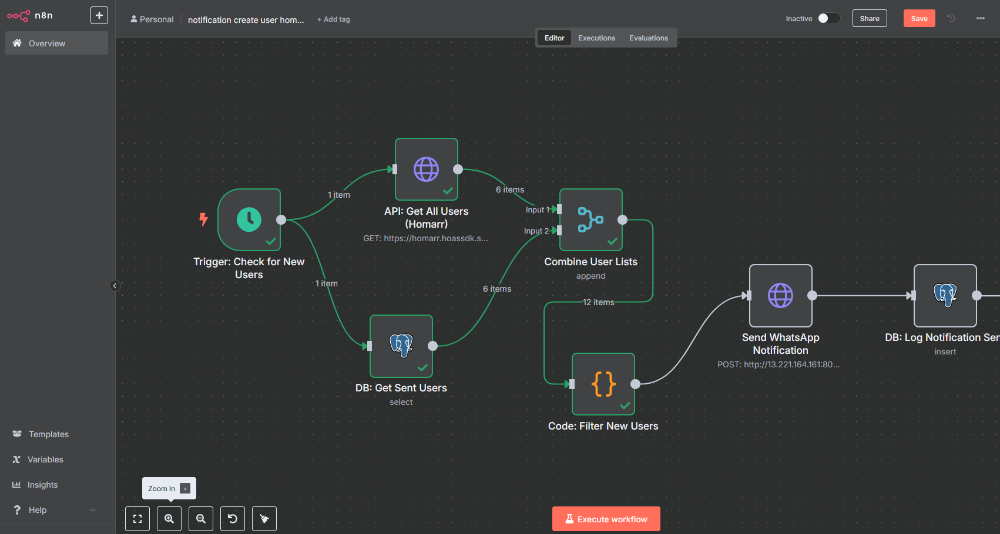

# Full-Stack Automation: Sistema de Notificação de Usuários em Tempo Real


Este repositório contém uma solução completa e auto-hospedada (self-hosted) para monitorar e notificar sobre a criação de novos usuários em uma plataforma, utilizando uma stack de automação moderna e robusta.

O projeto demonstra a capacidade de integrar múltiplos sistemas, desde a infraestrutura até a lógica de negócio, para criar um processo 100% automatizado.



---

## 🚀 Principais Funcionalidades

-   **Monitoramento Contínuo:** O sistema verifica novos usuários em intervalos de tempo definidos.
-   **Prevenção de Duplicidade:** Utiliza um banco de dados PostgreSQL para rastrear usuários já notificados/cadastrados, garantindo que cada notificação seja enviada apenas uma vez.
-   **Infraestrutura Containerizada:** Todos os serviços (n8n, PostgreSQL, Redis, Evolution API) são provisionados e gerenciados com Docker e Docker Compose, garantindo portabilidade e consistência do ambiente.
-   **Lógica de Negócio Customizada:** Um script em JavaScript dentro do n8n realiza a comparação e filtragem dos dados, demonstrando flexibilidade além do low-code.
-   **Notificação em Tempo Real:** Envia mensagens via WhatsApp assim que um novo usuário é detectado.

---

## 🛠️ Arquitetura e Tecnologias

A solução é composta por um ecossistema de serviços containerizados que se comunicam através de uma rede interna.

| Serviço | Tecnologia | Propósito |
| :--- | :--- | :--- |
| **Orquestrador** | n8n | Executa o workflow de automação e integra os demais serviços. |
| **Banco de Dados** | PostgreSQL | Armazena o histórico de usuários notificados para validação. |
| **Gateway de Mensagens** | Evolution API | Fornece a interface para o envio de notificações via WhatsApp. |
| **Cache & Estado**| Redis | Garante a performance e o gerenciamento de estado da Evolution API. |

---

## ⚙️ Primeiros Passos

### Pré-requisitos
-   [Docker](https://www.docker.com/products/docker-desktop/)
-   [Docker Compose](https://docs.docker.com/compose/install/)

### Instalação
1.  Clone este repositório para a sua máquina local:
    ```bash
    git clone [https://github.com/DeaconKrauser/n8n-docker-whatsapp-automation.git](https://github.com/DeaconKrauser/n8n-docker-whatsapp-automation.git)
    cd n8n-docker-whatsapp-automation
    ```

2.  Crie seu arquivo de variáveis de ambiente a partir do exemplo:
    ```bash
    cp .env.example .env
    ```

3.  Edite o arquivo `.env` com suas próprias credenciais e configurações (chaves de API, senhas do banco, etc.).

4.  Inicie todos os serviços com o Docker Compose:
    ```bash
    docker-compose up -d
    ```
    Os serviços estarão disponíveis nas portas configuradas no arquivo `docker-compose.yml`.

5.  Importe o workflow no n8n:
    -   Acesse sua instância do n8n (ex: `http://localhost:5678`).
    -   Copie o conteúdo do arquivo `workflow.json` e cole na tela de criação de um novo workflow.
    -   Configure as credenciais do n8n para o PostgreSQL.

---

## 👤 Autor

**Otávio Willker**
-   **LinkedIn:** [https://www.linkedin.com/in/otaviowc/](https://www.linkedin.com/in/otaviowc/)
-   **GitHub:** [https://github.com/DeaconKrauser](https://github.com/DeaconKrauser)
>>>>>>> 1f3d1af (versão inicial sistema de notificação de usuarios em tempo real)
